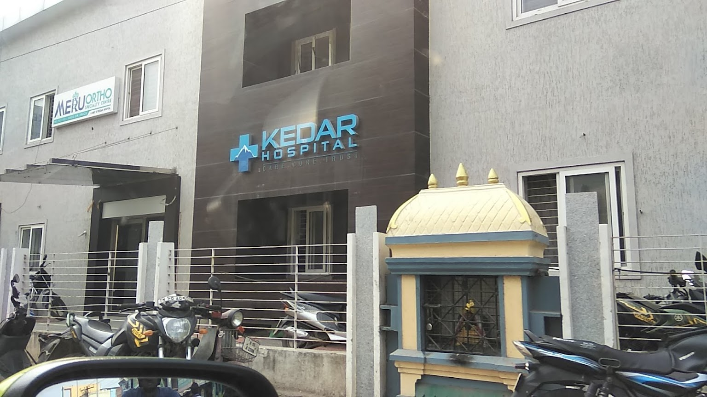
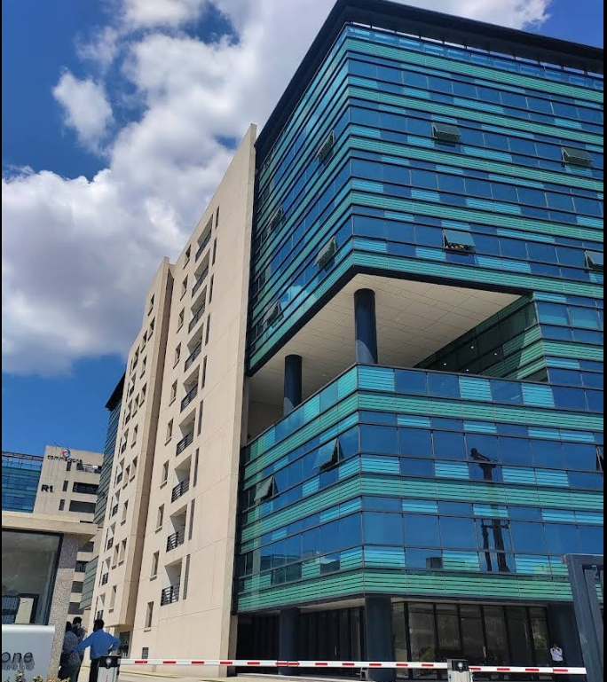
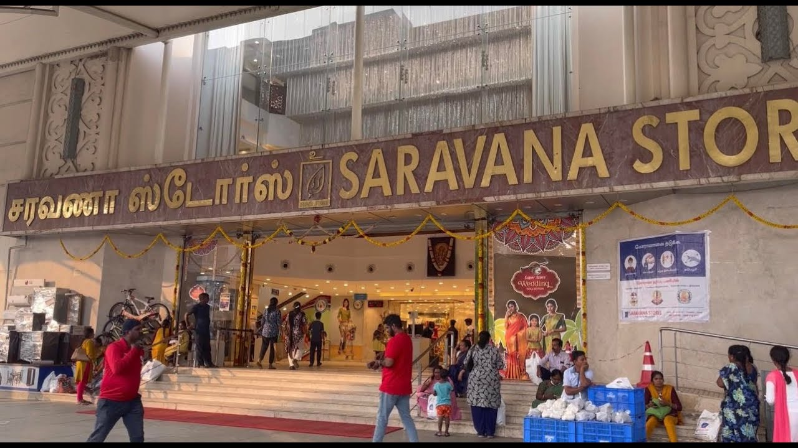
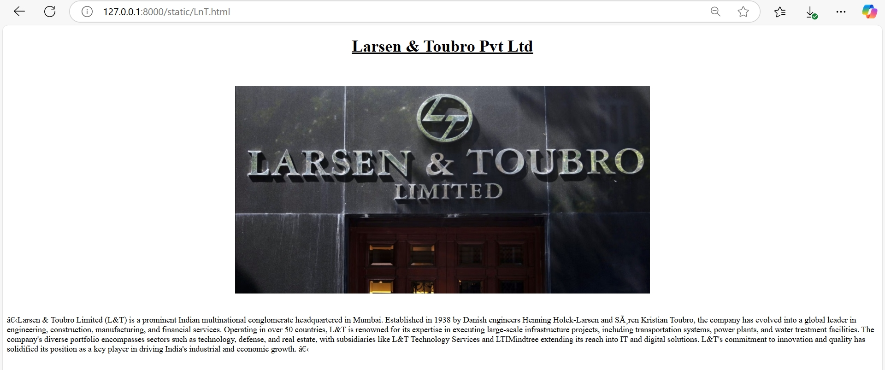
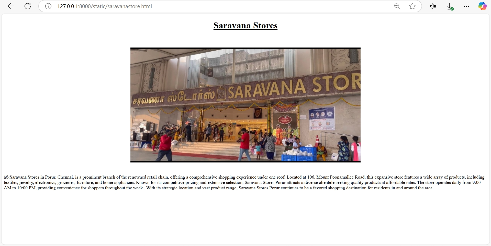
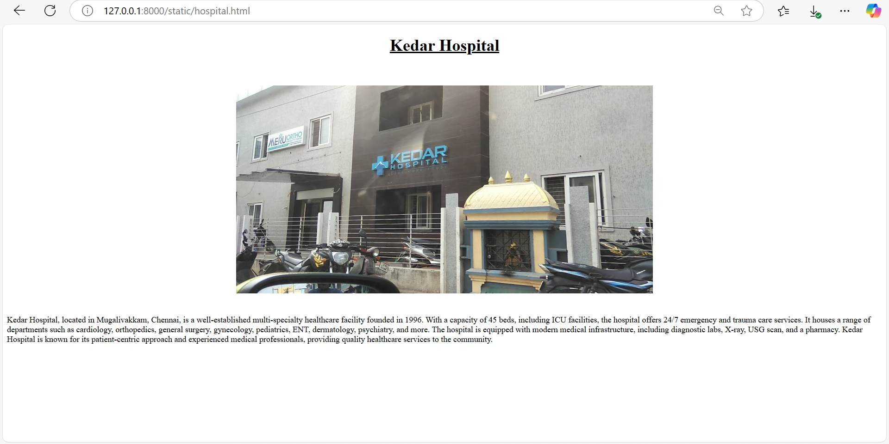
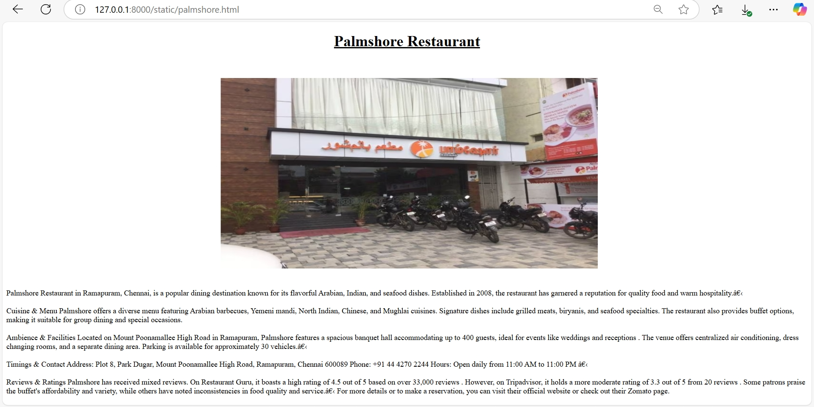
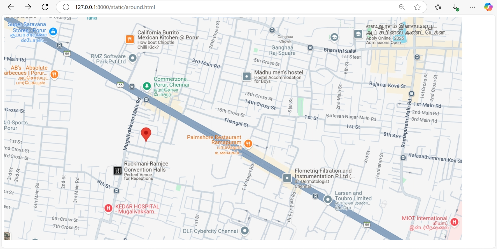
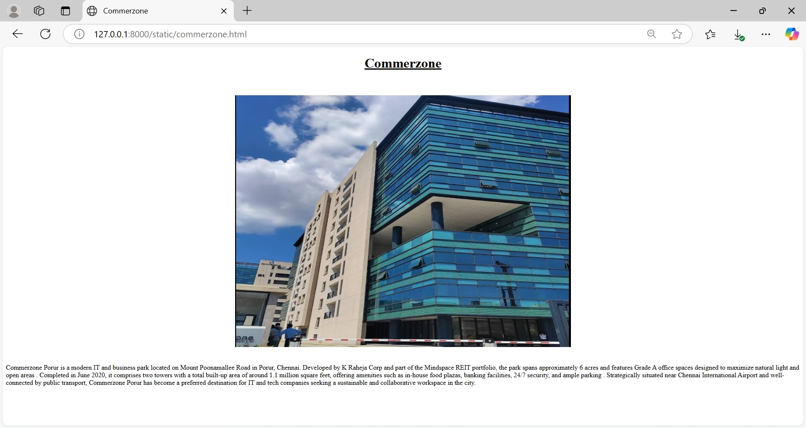

# Ex04 Places Around Me
## Name: V. Rakshita
## Reg no: 212224100049
## Date: 23.04.2025 

## AIM
To develop a website to display details about the places around my house.

## DESIGN STEPS

### STEP 1
Create a Django admin interface.

### STEP 2
Download your city map from Google.

### STEP 3
Using ```<map>``` tag name the map.

### STEP 4
Create clickable regions in the image using ```<area>``` tag.

### STEP 5
Write HTML programs for all the regions identified.

### STEP 6
Execute the programs and publish them.

## CODE

AROUND.HTML
```
<!DOCTYPE html>

<head>
    <title>Implementing Image Map</title>
</head>

<body>
    
    <map name="#MapNew">
        <area shape="rect" coords="625,395,820,466" </map href="palmshore.html" title="Palmshore Restaurant">
        <area shape="rect" coords="353,629,539,677" </map href="hospital.html" title="Kedar Hospital">
        <area shape="rect" coords="1118,595,1262,663" </map href="LnT.html" title="Larsen & Toubro Ltd">
        <area shape="rect" coords="470,203,599,271" </map href="commerzone.html" title="
        Commerzone">
        <area shape="rect" coords="11,20,146,80" </map href="saravanastore.html" title="Saravana Stores">
</body>
```
hospital.html
```
<!DOCTYPE html>

<head>
    <title>Kedar Hospital</title>
</head>

<body>
    <center>
        <h1><u>Kedar Hospital</u></h1>
    </center>
    <br><br>
    <center></center>
    <br><br>
    Kedar Hospital, located in Mugalivakkam, Chennai, is a well-established multi-specialty healthcare facility founded
    in 1996. With a capacity of 45 beds, including ICU facilities, the hospital offers 24/7 emergency and trauma care
    services.
    It houses a range of departments such as cardiology, orthopedics, general surgery, gynecology, pediatrics, ENT,
    dermatology, psychiatry, and more.
    The hospital is equipped with modern medical infrastructure, including diagnostic labs, X-ray, USG scan, and a
    pharmacy.
    Kedar Hospital is known for its patient-centric approach and experienced medical professionals, providing quality
    healthcare services to the community.
</body>
```
LnT.html

```
<!DOCTYPE html>

<head>
    <title>L&T Private Ltd</title>
</head>

<body>
    <center>
        <h1><u>Larsen & Toubro Pvt Ltd</u></h1>
    </center>
    <br><br>
    <center></center>
    <br><br>
    ​Larsen & Toubro Limited (L&T) is a prominent Indian multinational conglomerate headquartered in Mumbai.
    Established in 1938 by Danish engineers Henning Holck-Larsen and Søren Kristian Toubro, the company has evolved into
    a global leader in engineering, construction, manufacturing, and financial services. Operating in over 50 countries,
    L&T is renowned for its expertise in executing large-scale infrastructure projects, including transportation
    systems, power plants, and water treatment facilities. The company's diverse portfolio encompasses sectors such as
    technology, defense, and real estate, with subsidiaries like L&T Technology Services and LTIMindtree extending its
    reach into IT and digital solutions.
    L&T's commitment to innovation and quality has solidified its position as a key player in driving India's industrial
    and economic growth. ​
</body>
```
palmshore.html

```
<!DOCTYPE html>

<head>
    <title>Palmshore Restaurant</title>
</head>

<body>
    <center>
        <h1><u>Palmshore Restaurant</u></h1>
    </center>
    <br><br>
    <center></center>
    <br><br>
    ​Palmshore Restaurant in Ramapuram, Chennai, is a popular dining destination known for its flavorful Arabian,
    Indian, and seafood dishes.
    Established in 2008, the restaurant has garnered a reputation for quality food and
    warm hospitality.​
    <br><br>

    🍽️ Cuisine & Menu
    Palmshore offers a diverse menu featuring Arabian barbecues, Yemeni mandi, North Indian, Chinese, and Mughlai
    cuisines.
    Signature dishes include grilled meats, biryanis, and seafood specialties. The restaurant also
    provides buffet options, making it suitable for group dining and special occasions.
    <br><br>
    🏨 Ambience & Facilities
    Located on Mount Poonamallee High Road in Ramapuram, Palmshore features a spacious banquet hall accommodating up
    to 400 guests, ideal for events like weddings and receptions

    . The venue offers centralized air conditioning, dress changing rooms, and a separate dining area.
    Parking is available for approximately 30 vehicles.​
    <br><br>
    ⏰ Timings & Contact
    Address: Plot 8, Park Dugar, Mount Poonamallee High Road, Ramapuram, Chennai 600089

    Phone: +91 44 4270 2244

    Hours: Open daily from 11:00 AM to 11:00 PM
    Eazydiner
    ​
    <br><br>
    ⭐ Reviews & Ratings
    Palmshore has received mixed reviews. On Restaurant Guru, it boasts a high rating of 4.5 out of 5 based on over
    33,000 reviews . However, on Tripadvisor, it holds a more moderate rating of 3.3 out of 5 from 20 reviews . Some
    patrons praise the buffet's affordability and variety, while others have noted inconsistencies in food quality
    and service.​

    For more details or to make a reservation, you can visit their official website or check out their Zomato page.

</body>
```

commerzone.html

```
<!DOCTYPE html>

<head>
    <title>Commerzone</title>
</head>

<body>
    <center>
        <h1><u>Commerzone</u></h1>
    </center>
    <br><br>
    <center></center>
    <br><br>

    Commerzone Porur is a modern IT and business park located on Mount Poonamallee Road in Porur, Chennai. Developed by
    K Raheja Corp and part of the Mindspace REIT portfolio, the park spans approximately 6 acres and features Grade A
    office spaces designed to maximize natural light and open areas . Completed in June 2020, it comprises two towers
    with a total built-up area of around 1.1 million square feet, offering amenities such as in-house food plazas,
    banking facilities, 24/7 security, and ample parking . Strategically situated near Chennai International Airport and
    well-connected by public transport, Commerzone Porur has become a preferred destination for IT and tech companies
    seeking a sustainable and collaborative workspace in the city.
</body>
```

saravanastore.html

```
<!DOCTYPE html>

<head>
    <title>Saravana Stores</title>
</head>

<body>
    <center>
        <h1><u>Saravana Stores</u></h1>
    </center>
    <br><br>
    <center></center>
    <br><br>​Saravana Stores in Porur, Chennai, is a prominent branch of the renowned retail chain, offering a
    comprehensive shopping experience under one roof. Located at 106, Mount Poonamallee Road, this expansive store
    features a wide array of products, including textiles, jewelry, electronics, groceries, furniture, and home
    appliances. Known for its competitive pricing and extensive selection, Saravana Stores Porur attracts a diverse
    clientele seeking quality products at affordable rates. The store operates daily from 9:00 AM to 10:00 PM, providing
    convenience for shoppers throughout the week . With its strategic location and vast product range, Saravana Stores
    Porur continues to be a favored shopping destination for residents in and around the area.
</body>
```


## OUTPUT









 
## RESULT
The program for implementing image maps using HTML is executed successfully.
